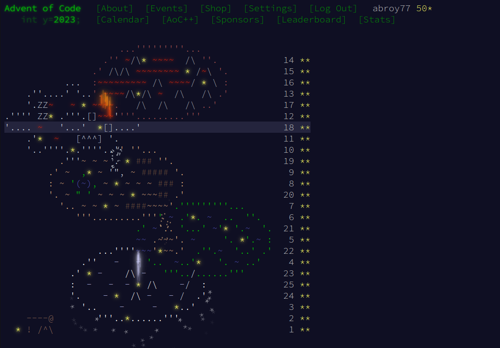

# AoC-2023
Completed!!!
This project has been one of the most difficult endeavours I've ever undertaken. It's helped me discover a whole host of algorithms, and libraries in Rust. 

## Completion Page

## Prerequisites
1. rustup
2. Cargo

[Easiest way to install both](https://www.rust-lang.org/tools/install)

## User Guide
1. `cd` into relevant directory
2. run `cargo run --bin <part1/part2> data/input1.txt`

### References
1. [HyperNeutrino's youtube](https://www.youtube.com/@hyper-neutrino)
2. [Chris Biscardi's youtube](https://www.youtube.com/@chrisbiscardi)
3. [Dazbo's Page on AoC](https://aoc.just2good.co.uk/)
